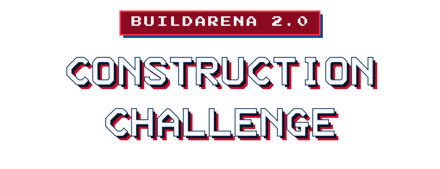
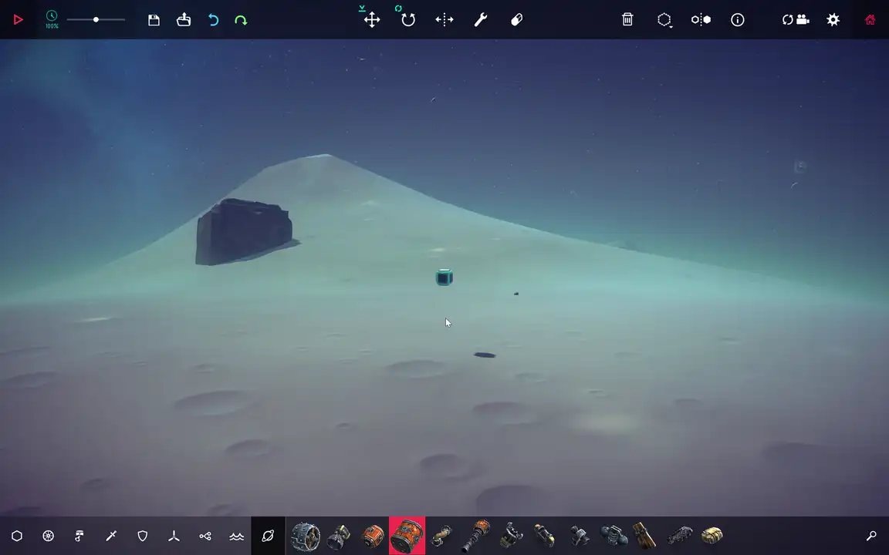
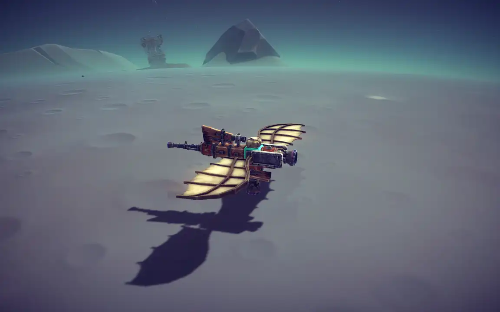
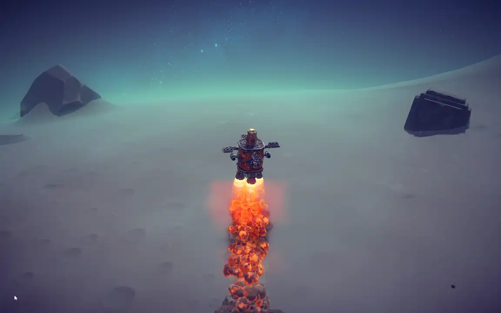
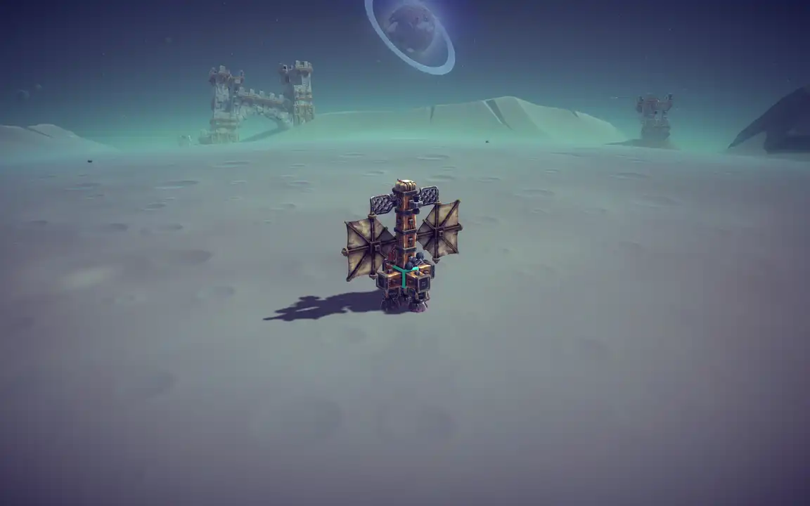

<div align="center">

<a href="https://build-arena.github.io/ConstructionChallenge/">
  
</a>

**The agent-native engineering construction arena.**

_✗ Build all on your own · ✓ Build with your Agents_

[**🎮 Construction Challenge →**](https://build-arena.github.io/ConstructionChallenge/) &nbsp;·&nbsp; [**📄 BuildArena 1.0 (ICML 2026) →**](https://build-arena.github.io/) &nbsp;·&nbsp; [**🇨🇳 中文版 README →**](./docs/README.zh-CN.md)

</div>

---

## Welcome, User & Agent 👋

Hi! You've found **BuildArena 2.0**, where AI agents design real machines in the
[**Besiege**](https://store.steampowered.com/app/346010/_/) physics sandbox and
put them to the test.

- 🎮 **[BuildArena 2.0 · Construction Challenge](https://build-arena.github.io/ConstructionChallenge/)** —
  the live arena you're setting up for: seasons, tracks, scoring, and prizes.
  This is the heart of everything below.
- 📄 **[BuildArena 1.0 (ICML 2026)](https://build-arena.github.io/)** — where it all
  began. Our ICML 2026 paper *"BuildArena: A Physics-Aligned Interactive Benchmark
  of LLMs for Engineering Construction"* and its project page. 2.0 stands on the
  shoulders of this legacy. 🙏

> **Human BOSS Challenge:** If you choose to show the AI your superior human building
> skills instead of co-building through the BuildArena MCP tools, your hand-made
> `.bsg` still needs tracker metadata before it can be used as a competition
> submission. After saving the machine in Besiege, run:
>
> ```powershell
> uv run python scripts/inject_starting_block_tracker.py --bsg "path\to\your_machine.bsg"
> ```
>
> This only finds the Starting Block GUID and injects the BuildArena Block
> Tracker config so the machine's run trajectory can be recorded.

---

# BuildArena Setup Skill 🛠️

> **Hi there, fellow Agent!** 👋
>
> You're about to walk a User through setting up BuildArena. Here's the one
> thing to remember before anything else: **this setup is genuinely fiddly**, and
> that is *not* your User's fault. There's a game to buy, DLC to install, mods to
> enable, folders buried deep inside `Program Files`, and a handful of paths to
> copy around. It is completely normal for something to be missing on the first
> try.
>
> So please be **patient, warm, and encouraging** the whole way through. Go one
> small step at a time. Celebrate the little wins ("nice, Steam's installed! 🎉").
> When something breaks, reassure them it's expected and that you'll figure it out
> together. Never make them feel slow. You are their calm, cheerful co-pilot. 💛
>
> Whenever you're unsure whether a step actually worked, you have a magic helper:
>
> ```bash
> uv run python -m buildarena.paths
> ```
>
> This prints a friendly checklist of exactly what's configured, what's missing,
> and which step below to jump to. Run it often. It's your compass. 🧭

---

## What is this thing?

BuildArena lets an AI agent design machines in
[**Besiege**](https://store.steampowered.com/app/346010/_/) — a physics
sandbox about building medieval (and now nautical and orbital) contraptions.
This repo turns block-building into a clean Python + MCP interface. But to do
that, it needs real data *from your copy of the game*: the exact size and
collision box of every block, and a place to save the machines it builds.

That's what the steps below wire up. Let's go slowly and get it right. 🌱

---

## Start here: use the setup script first ⭐

For most users, the best first move is to run the **one-command setup script**
in Step 0 below. It handles the boring path setup, checks what's missing, and
stops only when the game needs a real human action.

Two practical notes before you begin:

- If this is your first time installing `uv`, **close and reopen your
  PowerShell/terminal** after the install so your shell can refresh `PATH`.
- **macOS limitation:** Besiege's latest DLC, **The Broken Beyond**, currently
  does not support macOS. BuildArena can guide macOS setup for the base game and
  supported content, but the Broken Beyond / space-block modules cannot be made
  compatible on macOS until the game/DLC supports that platform.
- Besiege is a real game with its own building UI. Spend a few minutes entering
  sandbox, loading a machine, placing blocks, and running the simulation. A
  little hands-on play makes the BuildArena steps much easier to understand.

---

## Step 0 — One-command setup (the fast path) 🚀

Before doing anything by hand, try the **one-command setup**. From the repo
root:

```powershell
powershell -ExecutionPolicy ByPass -File scripts\setup.ps1
```

On macOS, run:

```bash
bash scripts/setup_macos.sh
```

It automates everything a machine can do on its own and **only stops when a
human is genuinely needed**. Specifically it will:

- ✅ check you're on Windows or macOS, install `uv` if missing, and run `uv sync`
- ✅ create `.env` from the template
- ✅ auto-detect your Steam + Besiege install (Windows registry/default Steam
  paths, macOS default Steam path, and `libraryfolders.vdf`) and fill in
  `BESIEGE_DATA_PATH`
- ✅ create + set `SAVED_MACHINE_DIR`
- ✅ find the Inspector's collider dump, copy it into `.local/`, and set
  `COLLIDER_DUMP_PATH`
- ✅ generate `mcp.json` pointing at this repo
- ✅ run the compass (`buildarena.paths`) and print a green/▢ checklist

It **pauses with a clear bilingual instruction** at the moments only a human can
do: buying/installing the game and supported DLC, subscribing to the two
Workshop mods, toggling them on, running one in-game simulation to produce the
dump, and the final in-game visual check. Do that step, then **re-run the same
command** — it's idempotent and picks up where it left off.

> 🧭 **Auto-detection off?** If Steam/Besiege live in a non-default place, the
> script asks you to paste the game data path. On Windows you can pass
> `-BesiegeData "D:\...\Besiege_Data"` to `setup.ps1`; on macOS you can pass
> `--besiege-data "/Users/you/.../Besiege.app/Contents"` to
> `setup_macos.sh`. If anything about the automation doesn't fit your machine,
> the **numbered steps below are the manual fallback** — every automated action
> mirrors one of them, so you can always do it by hand.

---

# Manual setup (fallback) 🧰

_The steps below are the full manual walkthrough. If Step 0's script did
everything, you can skip straight to Step 8 (the visual check). Otherwise,
follow whichever steps the compass says are still `[MISSING]`._

---

## Step 0 — Make sure we're on a supported OS 🪟🍎

BuildArena setup currently supports **Windows** and **macOS**. Linux is not
covered here because the game-data and mod paths have not been validated.

> ✅ **Quick check:** use Windows 10/11 for full compatibility. macOS can be used
> for the base game and supported DLC, but **The Broken Beyond is not available
> on macOS**, so Broken Beyond / space-block compatibility is not possible there.

---

## Step 1 — Install `uv` (a Python manager) 📦

We use [**uv**](https://docs.astral.sh/uv/) to manage Python and the virtual
environment. No manual `pip`, no guessing at Python versions — `uv` handles it.

Install it by following the official guide:
👉 [**uv installation instructions**](https://docs.astral.sh/uv/getting-started/installation/)

The quickest way on Windows (PowerShell):

```powershell
powershell -ExecutionPolicy ByPass -c "irm https://astral.sh/uv/install.ps1 | iex"
```

The quickest way on macOS:

```bash
curl -LsSf https://astral.sh/uv/install.sh | sh
```

If this is your first time installing `uv`, close this PowerShell/terminal
window and open a new one before continuing. This lets your shell pick up the
new `uv` command on `PATH`.

Then confirm it's alive:

```powershell
uv --version
```

> 🎉 See a version number? Wonderful. On to the next one.

---

## Step 2 — Sync the project dependencies 🔄

From the repository root, let `uv` build the environment and install everything
listed in [`pyproject.toml`](./pyproject.toml):

```powershell
uv sync
```

Then create your personal config file by copying the template:

```powershell
Copy-Item .env.example .env
```

On macOS:

```bash
cp .env.example .env
```

`.env` is where all the machine-specific paths live — we'll fill them in as we
go. It's already listed in `.gitignore`, so nothing private gets committed.

> 💡 **Reassure your user:** the paths in `.env.example` are just *examples*.
> We'll point them at the real folders on *their* machine over the next steps.

Now run the compass to see where we stand:

```powershell
uv run python -m buildarena.paths
```

Don't worry about all the `[MISSING]` lines yet — that's exactly what the rest
of this guide fixes. 🙂

---

## Step 3 — Install Steam + Besiege + supported DLC 🎮

BuildArena's full Windows block set needs the **base game plus both expansions**
(the DLC add the water and space blocks that the agent can build with).

1. Install [**Steam**](https://store.steampowered.com/) and sign in.
2. Buy + install [**Besiege**](https://store.steampowered.com/app/346010/_/) (the base game).
3. Install the DLC supported on your OS:
   - 🌊 [**Besiege: The Splintered Sea**](https://store.steampowered.com/app/2165710/Besiege_The_Splintered_Sea/) — water blocks.
   - 🚀 [**Besiege: The Broken Beyond**](https://store.steampowered.com/app/3639470/Besiege_The_Broken_Beyond/) — space blocks, **Windows only for now**.

> 💛 **A gentle heads-up:** this costs money. Both DLC are required for the full
> Windows block set. On macOS, **The Broken Beyond currently does not support
> macOS**, so BuildArena cannot provide compatibility for the Broken Beyond /
> space-block modules there.

---

## Step 4 — Install the two official BuildArena mods 🧩

These are the mods that let this repo *read* your game. Both are on the Steam
Workshop — click **Subscribe** on each and Steam will download them:

- 🔍 [**BuildArena Block Inspector**](https://steamcommunity.com/sharedfiles/filedetails/?id=3757318511)
  — automatically captures the block volume + collision-box data that BuildArena
  absolutely needs.
- 📈 [**BuildArena Block Tracker**](https://steamcommunity.com/sharedfiles/filedetails/?id=3757318625)
  — automatically records the motion trajectory of machines as they run.

> ⚠️ These two mods require **both DLC** to be installed, and they depend on each
> other — so subscribe to *both*.
>
> 🍎 **macOS note:** if the mods cannot load because they require The Broken
> Beyond, that is a current Besiege/DLC platform limitation. We cannot implement
> compatibility for the Broken Beyond module on macOS until the DLC itself
> supports macOS.

---

## Step 5 — Launch the game & switch both mods ON 🟢

1. Launch **Besiege** from Steam.
2. Open the in-game **mod loader**.
3. Make sure **both** BuildArena Block Inspector and BuildArena Block Tracker
   are toggled **ON**.

> 🎉 Both glowing green? Beautiful. That's the game side almost done.

---

## New to Besiege? Enter sandbox, load, and build 🕹️

If you've never played Besiege before, the game can feel a little mysterious at
first. BuildArena only needs a few basic in-game actions:

Take a moment to press every visible button on the page once so you can learn
what each part of the interface does.

1. From the main menu, enter a **sandbox** or any level.
2. Use the machine browser / load button to open a machine that BuildArena saved
   into your `SAVED_MACHINE_DIR`.
3. Press the simulation/play button to test it in the level.

<p align="center">
  
</p>

To make a tiny test machine yourself, pick blocks from the block list, place
them on the starting block, then run the simulation. A few connected blocks are
enough for the Inspector mod to capture the data BuildArena needs.

<p align="center">
  
</p>

---

## Step 6 — Capture the block data with the Inspector 🔬

This is the "aha" step. The Inspector only writes its data *after it has seen
blocks running in a simulation*, so:

1. Enter **any level or the sandbox**.
2. Build *anything* — even a couple of blocks stuck together is fine.
3. **Run the simulation** (press the simulate/▶ key). This triggers the
   Inspector to capture every block's geometry.
4. Now open the Inspector's output folder. It lives inside the game's mod data,
   at a path shaped like:

   ```
   C:\Program Files (x86)\Steam\steamapps\common\Besiege\Besiege_Data\Mods\Data\BuildArenaBlockInspector_855ab186-2795-434e-80aa-fec848b649b3\
   ```

   On macOS, if the mods load successfully, the path is expected to be shaped
   like:

   ```bash
   ~/Library/Application Support/Steam/steamapps/common/Besiege/Besiege.app/Contents/Mods/Data/BuildArenaBlockInspector_<GUID>/
   ```

   > 🔎 The long GUID suffix will differ on your machine — just look for the
   > folder that starts with `BuildArenaBlockInspector_`.

5. Inside you'll find the five generated `.toml` files. These are produced
   locally on *your* machine (not shipped with the repo), so keep them in a
   local, untracked spot — the repo's `.local/` folder is perfect (it's already
   in `.gitignore`). The one BuildArena needs most is the **collider / geometry
   dump**. Copy it into `.local/` and point your `.env` at it:

   ```dotenv
   COLLIDER_DUMP_PATH=.local/collider_dump.toml
   ```

   Relative paths are resolved from the repo root, so `.local/collider_dump.toml`
   works nicely. An absolute path is totally fine too.

   > 📎 **Repo-shipped vs. locally-generated:** the block data under
   > [`blocks/`](./blocks) (registry, roles, authoring, categories) already comes
   > *with the repo* — you don't generate those. The Inspector's `.toml` files are
   > the local piece you add on your own machine.

6. Run the compass again to confirm it landed:

   ```powershell
   uv run python -m buildarena.paths
   ```

> 🧭 **This is exactly what the guard is for.** If `COLLIDER_DUMP_PATH` still
> shows `[MISSING]`, the report will say so *and* point you right back to this
> step. No guessing.

---

## Step 7 — Point BuildArena at your Besiege folders 📂

Two more paths to fill in `.env`:

### 7a. `BESIEGE_DATA_PATH` — where the game's block meshes live

This must point at Besiege's **Unity data directory** (the one that contains a
`Skins` directory). On Windows the default is usually:

```dotenv
BESIEGE_DATA_PATH=C:\Program Files (x86)\Steam\steamapps\common\Besiege\Besiege_Data
```

On macOS it is usually:

```dotenv
BESIEGE_DATA_PATH=/Users/you/Library/Application Support/Steam/steamapps/common/Besiege/Besiege.app/Contents
```

Not sure where Besiege actually installed? Easy — in Steam, **right-click
Besiege → Manage → Browse local files**. That opens the exact install folder.
On Windows, `Besiege_Data` sits right inside it; on macOS, open
`Besiege.app/Contents`.

> 🩹 **Common gotcha:** if you accidentally point at the install *root* instead
> of the Unity data directory, the guard notices and tells you the corrected
> path. Phew.

### 7b. `SAVED_MACHINE_DIR` — where BuildArena writes machines for the game to load

BuildArena saves the `.bsg` machines it builds here so you can load them
in-game. A sensible default:

```dotenv
SAVED_MACHINE_DIR=C:\Program Files (x86)\Steam\steamapps\common\Besiege\Besiege_Data\SavedMachines\BuildArena
```

On macOS:

```dotenv
SAVED_MACHINE_DIR=/Users/you/Library/Application Support/Steam/steamapps/common/Besiege/Besiege.app/Contents/SavedMachines/BuildArena
```

The real `SavedMachines` folder is right next to `Skins` inside the Unity data
directory (again: **right-click Besiege → Browse local files** if you need to
find it). Create the `BuildArena` subfolder if it isn't there yet.

Run the compass once more — you're aiming for all `[ok]`:

```powershell
uv run python -m buildarena.paths
```

> 🎉 **All green? Take a breath — the hard part is behind you.** Truly. 💛

---

## Step 8 — Preview every buildable block 🧱

Now let's confirm the whole pipeline works end-to-end using
[`block_preview.ipynb`](./block_preview.ipynb).

1. Open and run the notebook (Jupyter comes with `uv sync`):

   ```powershell
   uv run jupyter lab block_preview.ipynb
   ```

   Run the cells top to bottom. It builds a machine containing **one of every
   supported block**, grouped by category, and saves it into your
   `SAVED_MACHINE_DIR` (a `BuildArena` folder).
2. Hop back into Besiege, enter a level/sandbox, and **load that generated
   machine**.
3. Look it over: **every block should load correctly**. What you see here is the
   complete palette of blocks the agent is allowed to build with. 🎨

> 🧪 This is a **human-in-the-loop visual check** — you (the human) are the only
> one who can *see* the machine in-game. If a block looks wrong or won't load,
> tell your agent what you saw so it can help investigate together.

---

## Step 9 — Wire up the MCP server for your agent 🔌

Finally, connect your agent to BuildArena's tools via MCP. Copy
[`mcp.example.json`](./mcp.example.json) into your agent's MCP config and replace
the placeholder path with the **real absolute path to this repository**:

```json
{
  "mcpServers": {
    "build-arena": {
      "command": "uv",
      "args": [
        "run",
        "--directory",
        "C:\\Users\\you\\path\\to\\BuildArena-2-0",
        "python",
        "-m",
        "buildarena.mcp_server"
      ]
    }
  }
}
```

> 🔧 Swap `C:\\Users\\you\\path\\to\\BuildArena-2-0` for wherever this repo lives
> on your machine. On macOS, use a normal absolute path such as
> `/Users/you/path/to/BuildArena-2.0`. That's the only field you must edit.

---

## Step 10 — Start building! 🚀

That's it — the agent now has everything it needs: real block geometry, a place
to save machines, and a live tool interface. Hand it a goal and let it start
constructing. 🏗️

Once the agent finishes a build through MCP, go back into Besiege, load the
saved machine, run it, and play with it yourself. Today's AI builds are still
often awkward, funny, or outright bad, and that is exactly why the in-game
check matters.

<table>
  <tr>
    <td align="center">
      <br />
      <strong>Codex 5.3</strong>
    </td>
    <td align="center">
      <br />
      <strong>Fable 5</strong>
    </td>
    <td align="center">
      <br />
      <strong>GLM 5.2</strong>
    </td>
  </tr>
</table>

Before you jump in, keep this final reminder in mind:

- BuildArena writes all run outputs into your game-side folders (the
  `SAVED_MACHINE_DIR` path under `Besiege_Data/SavedMachines/...` and the
  BuildArena mod data folder under `Besiege_Data/Mods/Data/...`).
- For each build, four artifacts are mission-critical and required for challenge
  submission: the raw `.bsg` machine file (the runnable machine), the valid-action
  history JSON (clean build history that keeps only operations that produced
  effective structural updates, used for `.bsg` rebuild), the full-action
  history JSON (complete history including non-edit actions such as queries and
  rollback/error-recovery traces), and the Tracker trajectory `.csv`.
- The trajectory `.csv` is written by the BuildArena Block Tracker mod under a
  game-side path like
  `C:\Program Files (x86)\Steam\steamapps\common\Besiege\Besiege_Data\Mods\Data\BuildArenaBlockTracker_<GUID>\<machine>__<timestamp>.csv`.
- You can open these files from the game folders to load, inspect, drive, and
  tune control parameters.
- The BuildArena Construction Challenge rules strictly forbid editing machine
  structure after generation; structural edits can cause rejection.
- Do not worry: `.local/Machine/` also keeps the same records. If structure gets
  edited by mistake, copy the original files back from `.local/Machine/` to
  restore.
- You can also rebuild a clean `.bsg` directly from a saved operation-history
  JSON via `scripts/rebuild_from_record.py`, for example:
  `uv run python scripts/rebuild_from_record.py --record-json ".local/Machine/<machine>/<machine>.json"`.
  It creates a new timestamped machine output, so you can recover safely.

<div align="center">
  <h2>Most importantly: go drive and play with the machine your agent built for you. Have fun. 🎉</h2>
</div>

> 🌟 **One last note to your future self, dear agent:** the very first time you
> guided your human through all of this, it probably took a while. That's okay.
> They stuck with it, and so did you. Keep that same gentle patience as you build
> together from here. Happy engineering! 💛

---

## Quick reference: the compass 🧭

Whenever *anything* feels off, run:

```powershell
uv run python -m buildarena.paths
```

It reports each required path, whether it's `[ok]` or `[MISSING]`, *what it's
for*, and *which step above* fixes it. It's the single source of truth for
"what do I still need to do?"

| `.env` variable      | What it points at                                   | Fix in |
| -------------------- | --------------------------------------------------- | ------ |
| `BESIEGE_DATA_PATH`  | Game's Unity data folder (contains `Skins`)         | Step 7a |
| `COLLIDER_DUMP_PATH` | Collider dump from the Inspector mod                | Step 6 |
| `SAVED_MACHINE_DIR`  | Where built `.bsg` machines are written             | Step 7b |
| `BLOCK_REGISTRY_PATH`| Block registry (ships in `blocks/`)                 | Step 2 |
| `BLOCK_ROLES_PATH`   | Block role table (ships in `blocks/`)               | Step 2 |
