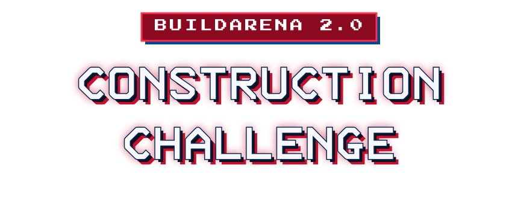

<div align="center">

<a href="https://build-arena.github.io/ConstructionChallenge/">
  
</a>

**From machine design to autonomous execution.**

[Construction Challenge](https://build-arena.github.io/ConstructionChallenge/) · [BuildArena 1.0](https://build-arena.github.io/) · [中文 README](./docs/README.zh-CN.md)

</div>

BuildArena 2.0 gives AI agents an end-to-end engineering workflow in
[Besiege](https://store.steampowered.com/app/346010/_/): **automated game launch
and execution, machine construction, closed-loop control, telemetry, and timeline
replay**, with a Python interface and **MCP tools**. Powered by
[BuildArena ToolKit](https://steamcommunity.com/sharedfiles/filedetails/?id=3795335349)
and the Besiege CLI, agents can build a machine, run it, observe its behavior, and
control it in simulation.

- **[Construction Challenge](https://build-arena.github.io/ConstructionChallenge/)**: tracks, scoring, rules, and submissions.
- **[BuildArena 1.0 (ICML 2026)](https://build-arena.github.io/)**: the original benchmark, paper, and project.
- **[Control guide](./control/README.md)**: run commands, controllers, telemetry, and replay.

## Run three automatic machine examples

After [one-command setup](#one-command-setup), run these from the repository root.
Each command rebuilds its final machine from **one MCP tool-history JSON**, then
launches the game and runs the complete controller:

```powershell
# Heavy rocket: reach orbit, complete one revolution, and return to land
uv run python control/examples/rocket_orbit_return/run.py

# Transforming car: drive, take off, perform aerobatics, land, and drive on
uv run python control/examples/transforming_car_aerobatics/run.py

# Shuttle: orbital flight, twin-booster return, and glide recovery
uv run python control/examples/shuttle_booster_recovery/run.py
```

Each example directory contains only `machine.json` and its Python launch/control
code. The shuttle's four hinge limits and three blade flips are applied before
simulation; its geometry comes entirely from the history. Rebuilt machines,
calibration bindings, logs and telemetry go to the Git-ignored `datacache/manual_cases/`.
Setup itself uses the same rocket orbit-and-return Python runner.
The car runner re-enters the sandbox before loading the machine to clear stale
building objects. This happens before the optional camera-editing pause.

**Place cameras and record manually:** append `--edit-before-start` to any command.
After the machine loads in build mode, add cameras, **Save As** the name printed
in the terminal, then type `yes`. For an explicit save name:

```powershell
uv run python control/examples/rocket_orbit_return/run.py --edit-before-start --camera-bsg Rocket_orbit_camera
# Next recording: reuse cameras without the editing pause
uv run python control/examples/rocket_orbit_return/run.py --camera-bsg Rocket_orbit_camera
```

Use OBS or another external recorder and the game's camera controls; these
scripts do not enable CLI screen recording or camera follow. Rebuilding displays
a tqdm progress bar; simulation starts without a countdown or recording reminder.
The default tail is 20 simulation seconds after controller completion.
Use `--tail-seconds` or `--prepare-only` as needed.
The latter only rebuilds, without loading or simulating in the game.

## One-command setup

**On Windows 10 or 11, run this from the repository root in PowerShell:**

```powershell
uv run python scripts/setup.py
```

**No [uv](https://docs.astral.sh/uv/) installed?** Use the wrapper, which installs `uv`, runs `uv sync`,
and launches the same setup script:

```powershell
powershell -ExecutionPolicy ByPass -File scripts\setup.ps1
```

Setup configures everything automatically and runs two machine tests in Besiege.
Just sit back and watch them run on screen.

### When you need to intervene

The automated setup has only three expected cases requiring human input:

1. **Purchase and install the game and both DLC through Steam:**
   [Besiege](https://store.steampowered.com/app/346010/_/),
   [The Splintered Sea](https://store.steampowered.com/app/2165710/Besiege_The_Splintered_Sea/),
   and [The Broken Beyond](https://store.steampowered.com/app/3639470/Besiege_The_Broken_Beyond/).
2. **Subscribe to [BuildArena ToolKit](https://steamcommunity.com/sharedfiles/filedetails/?id=3795335349)
   and let Steam download it.** The published Workshop item is required; there is
   no local-mod fallback.
3. **Provide the game-data path if Besiege is outside the default Steam location:**

   ```powershell
   uv run python scripts/setup.py --besiege-data "D:\SteamLibrary\steamapps\common\Besiege\Besiege_Data"
   ```

   With the wrapper, use `-BesiegeData "D:\SteamLibrary\steamapps\common\Besiege\Besiege_Data"`.
   Point to **`Besiege_Data`**, not the installation root. To locate it, use
   **Steam → Besiege → Manage → Browse local files**.

Rerun setup after resolving a missing prerequisite. It checks actual artifacts
before continuing.

## Diagnostics

```powershell
uv run python -m buildarena.paths
```

This reports configured and missing paths, ToolKit installation, and setup status.
Check `.local/setup-report.json` for the validation result; a successful setup
records `status=passed`.

## Manual setup fallback

Use these steps if you need to configure paths or troubleshoot individual stages.
Inspector initialization and in-game validation still use the setup script.

1. **Prepare Windows and Steam.** Install the game, both DLC, and the ToolKit
   Workshop item listed above. Remove or disable retired Controller, Block
   Tracker, Collider Dumper, and Block Inspector mods so only the current ToolKit
   is active.
2. **Install [uv](https://docs.astral.sh/uv/getting-started/installation/), then
   prepare the environment** from the repository root:

   ```powershell
   uv sync
   Copy-Item .env.example .env
   ```

   Copy the template only if `.env` does not already exist.
3. **Set the local paths in `.env`**, adjusting the game location as needed:

   ```dotenv
   BESIEGE_DATA_PATH=C:\Program Files (x86)\Steam\steamapps\common\Besiege\Besiege_Data
   SAVED_MACHINE_DIR=C:\Program Files (x86)\Steam\steamapps\common\Besiege\Besiege_Data\SavedMachines\BuildArena
   COLLIDER_DUMP_PATH=.local/collider_dump.toml
   ```

   Create the `SavedMachines\BuildArena` folder if needed. Relative paths resolve
   from the repository root; the collider dump is generated in the next step.
4. **Enable ToolKit in Besiege's mod loader**, then run
   `uv run python scripts/setup.py` to initialize Inspector, collect artifacts,
   and validate the control stack. Do not use the retired block-clicking or
   `block_preview.ipynb` workflow. Run the diagnostics command above to verify.
5. **Connect your agent through MCP** using the configuration below.

For older checkouts, setup does not migrate legacy generated configuration.
Clear obsolete setup artifacts before rerunning; preserve `datacache/` and
machine records in `.local/Machine/`.

## Connect through MCP

Setup generates **`mcp.json`** with this checkout's absolute path. Import it into
your agent's MCP configuration, or use [`mcp.example.json`](./mcp.example.json)
and replace the repository path:

```json
{
  "mcpServers": {
    "build-arena": {
      "command": "uv",
      "args": [
        "run",
        "--directory",
        "C:\\Users\\you\\path\\to\\BuildArena-2-0",
        "python",
        "-m",
        "buildarena.mcp_server"
      ]
    }
  }
}
```

For direct CLI access and control examples, see [`control/README.md`](./control/README.md):

```powershell
cd control
uv run python -m besiege_cli --help
```

## Challenge outputs and submission

Keep all three required build artifacts:

| Artifact | Purpose |
| --- | --- |
| Raw `.bsg` machine | The runnable machine. |
| Valid-action history JSON | Effective structural updates used to rebuild the machine. |
| Full-action history JSON | Complete history, including queries and rollback/error-recovery traces. |

Game-side outputs live in `SAVED_MACHINE_DIR` and the ToolKit data folder under
`Besiege_Data/Mods/Data/`. Build records are also retained in `.local/Machine/`.

**Do not manually modify the generated machine structure.** Structural edits can
invalidate a [Construction Challenge submission](https://build-arena.github.io/ConstructionChallenge/).
You may load, inspect, and drive the machine and tune control parameters.

To recover an original machine, restore its records from `.local/Machine/` or
rebuild from its saved operation history:

```powershell
uv run python scripts/rebuild_from_record.py --record-json ".local/Machine/<machine>/<machine>.json"
```

Rebuilding creates a new timestamped machine output.
